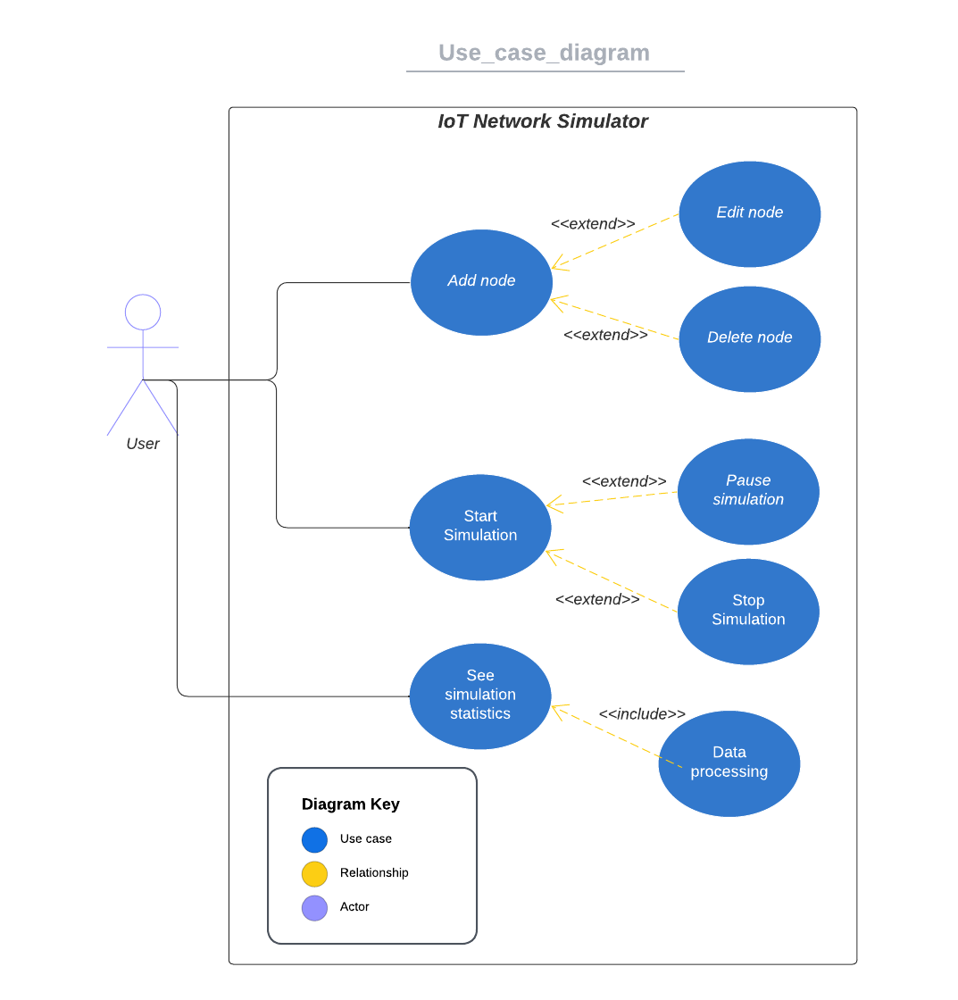
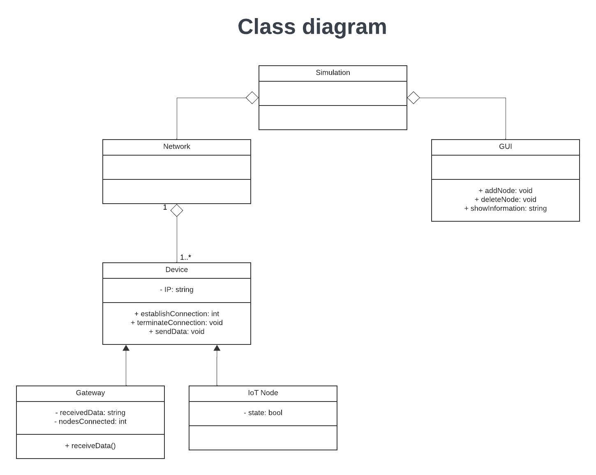

# Project 3: Simulator for wireless communication

## Use-case

- 1 gateway
- Many nodes that are IoT devices
- Simulation of network communication
- Gui
- Network statistics is captured

> An IoT **network** is simulated in a **GUI**, where a **gateway** is placed in the middle, and **nodes** can be placed around it. The **nodes** send **data** through the **gateway**, which can send it to somewhere on the **internet**. The **GUI** can show **information** relevant to the **network** health after the **simulation** is run.

### Diagrams

[Use case diagram link](https://lucid.app/lucidchart/f4db6b94-e36f-4ea7-b3fd-291768914556/edit?viewport_loc=-861%2C-53%2C2700%2C1400%2C.Q4MUjXso07N&invitationId=inv_7fd65a4d-01b7-413e-aac4-9303be33da65)

[Domain model link](https://lucid.app/lucidchart/3e0f91a6-954e-41bd-acbc-81f5e3876da9/edit?viewport_loc=-49%2C190%2C1815%2C956%2C0_0&invitationId=inv_ee6e331d-06f7-4ed6-a67d-f7d2be579261)

[Class diagram link](https://lucid.app/lucidchart/c063cbe8-86a5-468a-8711-1662978fabb0/edit?view_items=~PRykaqnz1hy&invitationId=inv_96b03faf-6b01-4af4-9152-576b23904d31)

### Objects and their methods

- Network
- GUI
  - Add node
  - Delete node
  - Stop simulation
  - Start simulation
  - Pause simulation
  - Show information
- Gateway
  - Receive data
  - Forward data
- Nodes
  - Send data

### Considerations

- Handle collision or just know it happened \(collision avoidance vs. collision detection\)?
- Perhaps implement random access to the channel first, and then if interesting/we have time, implement a protocol.

## Analysis

### Nodes

- What is a block of data? 
- Is the transmission a method or an attribute?
- 

### Gateway

# Notes from Workshop 1

